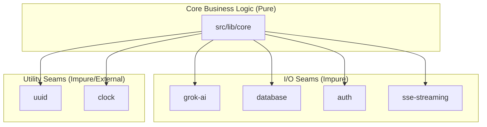

# Application Architecture

Generated by `seam-cli visualize`.

```mermaid
graph TD
    subgraph "Core Business Logic (Pure)"
        core[src/lib/core]
    end

    subgraph "I/O Seams (Impure)"
        seam_grok_ai[grok-ai]
        seam_database[database]
        seam_auth[auth]
        seam_sse_streaming[sse-streaming]
    end

    subgraph "Utility Seams (Impure/External)"
        seam_uuid[uuid]
        seam_clock[clock]
    end

    core --> seam_grok_ai
    core --> seam_database
    core --> seam_auth
    core --> seam_uuid
    core --> seam_clock
    core --> seam_sse_streaming
```
